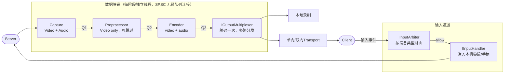

> 参见 [02-reference.md](02-reference.md) 查看接口定义与实现细节

# Pulsar

## 概述

**Pulsar** 是一个跨平台的串流服务器，目标是覆盖三类场景：

- **游戏串流**：低延迟串流游戏，支持多人同时登录同一台服务器协作游戏。
- **直播与录制**：多路推流 Twitch / YouTube 等，同时支持本地录制。
- **远程开发**：在无显示器的服务器上远程工作。

所有场景运行在同一套代码上，通过配置文件切换，无需额外界面或依赖多个不兼容的工具。

**平台特性**：跨 Linux / Windows / macOS 三平台，各自采用最优原生路径。架构上采用六边形架构（端口与适配器模式）：编码器、传输协议、采集方式均为独立 Adapter，互不感知，新增协议或平台只需增加 Adapter，core 层不动。第三方依赖严格分层，core 层零外部依赖，构建时零网络请求。

## 系统架构图

### 第一层：管道主线

抽象数据流：视频和音频复用同一管道结构。



### 第二层：各组件平台实现

每个管道阶段在三平台的具体实现。Factory 在启动时根据能力协商选择最优组合，`config.json` 可强制指定。

#### Capture（`video/capture/` + `audio/capture/`）

**视频采集**

| 实现 | 平台 | 特点 |
|------|------|------|
| `PipeWireCapture` | Linux | PipeWire ScreenCast/RemoteDesktop；server 自举虚拟显示器；**headless 首选**，不依赖物理桌面登录；GNOME/KDE Wayland 下开箱可用 |
| `DrmVirtualCapture` | Linux | DRM/KMS 虚拟显示；dmabuf fd 直传 encoder，不经 CPU；支持 dirty_rects；适合裸金属/GPU 直通场景 |
| `IDDVirtualDisplay` | Windows | IDD 虚拟显示；D3D11 纹理句柄直传，不经 CPU |
| `CGVirtualDisplay` | macOS | CGVirtualDisplay API；IOSurface 句柄直传，不经 CPU |

**音频采集**

| 实现 | 平台 | 特点 |
|------|------|------|
| `PipeWireAudioCapture` | Linux | PipeWire 系统音频回路；pts_us 单调时钟对齐 |
| `WASAPICapture` | Windows | WASAPI 桌面音频回路 |
| `CoreAudioCapture` | macOS | CoreAudio |

#### Preprocessor（格式已匹配时 Factory 返回 nullptr，Pipeline 完全跳过此阶段）

| 实现 | 平台 | 特点 |
|------|------|------|
| `DMABUFImporter` | Linux | dmabuf fd → VA encoder surface，全程 GPU，不经 CPU |
| `GPUPreprocessor` | Linux | VA-API VPP，BGRA→NV12 GPU 内转换 |
| `GPUPreprocessor` | Windows | D3D11 shader，BGRA→NV12 GPU 内转换 |
| `GPUPreprocessor` | macOS | Metal shader，BGRA→NV12 GPU 内转换 |
| `CPUPreprocessor` | 全平台 | libyuv 软件转换，任意格式兜底 |

#### Encoder（`video/encoder/` + `audio/encoder/`）

**视频编码**

| 实现 | 平台 | 特点 |
|------|------|------|
| `NvencEncoder` | Linux / Windows | NVIDIA 硬件；低延迟预设（max_b_frames=0）、intra-refresh、GPU 异步编码 |
| `VaapiEncoder` | Linux | Intel/AMD 硬件；低延迟预设、GPU 异步编码 |
| `VideoToolboxEncoder` | macOS | Apple 硬件；低延迟预设、Apple Silicon 异步编码 |
| `AMFEncoder` | Linux / Windows | AMD 硬件；dlopen 动态加载 |
| `X264Encoder` | 全平台 | 软件 H.264 兜底；静态库随源码入库 |

**音频编码**

| 实现 | 平台 | 特点 |
|------|------|------|
| `OpusEncoder` | 全平台 | 低延迟音频；静态库随源码入库 |

#### Transport

| 实现 | 平台 | 特点 |
|------|------|------|
| `RtpTransport` | 全平台 | 最薄基准层，局域网/benchmark |
| `WebRtcTransport` | Linux / Windows | NAT 穿透；FEC、pacing、adaptive jitter buffer；DataChannel 输入；浏览器客户端 |
| `QuicTransport` | Linux | 高性能原生客户端；多路复用；FEC、pacing；完全可控 |
| `WebTransportAdapter` | Linux / Windows | 浏览器可用的 QUIC（HTTP/3 上层）；延迟接近原生 QUIC；需 WebTransport 协议（预留） |
| `RtmpTransport` | 全平台 | 推流到 Twitch/YouTube（预留） |
| `SrtTransport` | 全平台 | 低延迟推流（预留） |

#### Input

| 实现 | 平台 | 特点 |
|------|------|------|
| `UinputHandler` | Linux | /dev/uinput，键鼠/手柄/触摸全支持；Wayland 下需要 seat-aware 设备命名（绑定 server 托管的虚拟会话 seat，headless 下即服务器自启的虚拟 compositor 所在 seat），独立相对/绝对鼠标设备与 udev seat 规则 |
| `Win32InputHandler` | Windows | SendInput + ViGEm 虚拟手柄 |
| `IOKitInputHandler` | macOS | IOKit CGEvent |

> Linux / Wayland 说明：要让 compositor 接受注入输入，虚拟输入设备需要落到 server 托管的虚拟会话 seat（headless 下即服务器自启的虚拟 compositor/Wayland session 所在 seat，而不是要求实体用户已登录）。实现上会参考 Sunshine 的做法，按 `XDG_SEAT` 给设备名加后缀，并通过 udev 规则把这些设备标记到对应 seat。Linux 侧会分离相对鼠标和绝对鼠标设备，分别覆盖常规拖动和绝对定位。

#### 各平台最优链路

Factory 自动选择；`config.json` 可强制指定各阶段 backend。

| 平台 | Capture | Preprocessor | Encoder | Transport |
|------|---------|-------------|---------|-----------|
| Linux 最优（headless，默认） | PipeWireCapture | DMABUFImporter / CPUPreprocessor | VaapiEncoder / NvencEncoder | QUIC（原生客户端）/ WebRTC（浏览器）|
| Linux 最优（裸金属/GPU 直通） | DrmVirtualCapture | DMABUFImporter | VaapiEncoder / NvencEncoder | QUIC（原生客户端）/ WebRTC（浏览器）|
| Windows 最优 | IDDVirtualDisplay | GPUPreprocessor | NvencEncoder / AMFEncoder | QUIC（原生客户端）/ WebRTC（浏览器）|
| macOS 最优 | CGVirtualDisplay | GPUPreprocessor | VideoToolboxEncoder | QUIC（原生客户端）/ WebRTC（浏览器）|
| 软件兜底 | 任意 | CPUPreprocessor | X264Encoder | RTP |

> **Pipeline 级优化**：SPSC 无锁队列（相邻阶段零竞争）、drop_on_overflow（背压保帧率）、idle_fps 降速（画面静止时降低采集率节省资源）、Transport FEC 丢包率 >2% 时自动开启。

> **Headless 语义**：Pulsar 的 server 默认按 headless 方式运行，也就是不依赖实体用户登录到本机物理桌面；但它仍然必须托管一个可被采集/注入的虚拟会话（虚拟 compositor / 虚拟显示 / 虚拟桌面）。如果管理员临时登录了图形环境，只是作为调试或运维手段，不改变 server 的 headless 目标。

> **共享会话**：直播或多观众场景共享的是 server 侧托管的同一个虚拟会话，而不是要求每个观众各自登录一个物理桌面会话。Session manager / shared_session 负责的是网络会话和输入归属，虚拟桌面由 server 统一提供。

---

## 工程目录结构

> **依赖链接方式**：`[static]` 静态库随源码入库 / `[header]` 头文件入库 / `[system]` pkg-config / `[dlopen]` 运行时加载 / `[builtin]` 系统内建

```
Pulsar/
├── CMakeLists.txt
├── config.json
│
├── common/include/nlohmann/json.hpp     # JSON [header-only]
│
├── core/                                # 零第三方依赖，所有接口定义
│   ├── include/
│   │   ├── pipeline.h                   # run_pipeline()、PipelineConfig
│   │   ├── frame.h                      # RawFrame、EncodedPacket、DirtyRect
│   │   ├── audio.h                      # AudioFrame、AudioPacket
│   │   ├── capture.h                    # ICaptureSource
│   │   ├── audio_capture.h              # IAudioCapture
│   │   ├── preprocessor.h               # IPreprocessor
│   │   ├── encoder.h                    # IEncoder
│   │   ├── audio_encoder.h              # IAudioEncoder
│   │   ├── audio_playback.h             # IAudioPlayback
│   │   ├── transport.h                  # ITransport
│   │   ├── packet_sink.h                # IPacketSink
│   │   ├── multiplexer.h                # IOutputMultiplexer
│   │   ├── recorder.h                   # IRecorder
│   │   ├── input.h                      # IInputHandler
│   │   ├── shared_session.h             # IInputArbiter
│   │   ├── auth.h                       # IAuthProvider、AuthToken
│   │   ├── session.h                    # ISessionManager、Session
│   │   ├── audio_mixer.h                # IAudioMixer
│   │   ├── chat.h                       # IChatChannel
│   │   ├── wake_on_lan.h                # IWakeOnLan
│   │   ├── app_manager.h                # IAppManager
│   │   ├── dispatcher.h                 # IConnectionDispatcher
│   │   ├── capabilities.h               # AdapterCapabilities
│   │   ├── queue.h                      # SPSCQueue
│   │   ├── buffer_pool.h                # IBufferPool
│   │   ├── reconnect.h                  # ReconnectPolicy、PipelineState
│   │   ├── negotiation.h                # ICapabilityNegotiator、NegotiatedParams
│   │   ├── metrics.h                    # PipelineMetrics
│   │   ├── profiler.h                   # IProfiler、ServerProfile
│   │   ├── error.h                      # StreamError
│   │   └── logger.h                     # ILogger
│   └── src/pipeline.cpp
│
├── video/
│   ├── capture/
│   │   ├── linux/pipewire/              # PipeWire ScreenCast  [system: libpipewire-0.3]  ← headless 默认
│   │   ├── linux/drm_virtual/           # DRM/KMS 虚拟显示      [system: libdrm]
│   │   ├── windows/virtual_display/     # IDD 虚拟显示         [system: wdf/idd]
│   │   └── macos/cgvirtual/             # CGVirtualDisplay     [system: framework]
│   ├── preprocessor/
│   │   ├── linux/dmabuf/                # DMABUF 零拷贝导入    [system: libdrm]
│   │   ├── linux/gpu/                   # VA-API VPP           [system: libva]
│   │   ├── windows/gpu/                 # D3D11 shader         [builtin: d3d11]
│   │   ├── macos/gpu/                   # Metal shader         [system: Metal]
│   │   └── all/cpu/                     # libyuv 软件兜底      [static: libyuv.a]
│   └── encoder/
│       ├── nvenc/linux/                 # NVIDIA NVENC         [dlopen: libnvidia-encode.so]
│       ├── nvenc/windows/               # NVIDIA NVENC（预留）
│       ├── vaapi/linux/                 # Intel/AMD VA-API     [system: libva]
│       ├── amf/linux/                   # AMD AMF              [dlopen: libamfrt64.so]
│       ├── amf/windows/                 # AMD AMF（预留）
│       ├── videotoolbox/macos/          # Apple VideoToolbox   [system: framework]
│       └── x264/all/                    # 软件 H.264 兜底      [static: libx264.a]
│
├── audio/
│   ├── capture/
│   │   ├── linux/pipewire/              # PipeWire 音频回路    [system: libpipewire-0.3]
│   │   ├── windows/wasapi/              # WASAPI 音频回路      [builtin: Win32 COM]
│   │   └── macos/coreaudio/             # CoreAudio            [system: framework]
│   └── encoder/
│       ├── opus/all/                    # Opus 低延迟          [static: libopus.a]
│       ├── aac/windows/                 # Media Foundation AAC [builtin: Win32]
│       └── aac/macos/                   # AudioToolbox AAC     [system: framework]
│
├── transport/
│   ├── rtp/all/                         # RTP/UDP 基准层       [builtin: POSIX]
│   ├── webrtc/linux/                    # libwebrtc            [static: libwebrtc.a]
│   ├── webrtc/windows/                  # 预留
│   ├── quic/linux/                      # ngtcp2               [system: libngtcp2]
│   ├── quic/windows/                    # msquic（预留）
│   ├── webtransport/linux/              # HTTP/3 WebTransport  [system: libngtcp2]（预留）
│   ├── rtmp/all/                        # RTMP 推流（预留）    [static: librtmp.a]
│   └── srt/all/                         # SRT 推流（预留）     [static: libsrt.a]
│
├── input/
│   ├── linux/uinput/                    # uinput               [builtin: /dev/uinput]
│   ├── windows/win32/                   # SendInput + ViGEm    [builtin: Win32]
│   └── macos/iokit/                     # IOKit CGEvent        [system: framework]
│
├── auth/all/
│   ├── password/                        # 本地密码文件         [builtin]
│   ├── oauth/                           # OAuth 2.0            [static: libcurl.a]
│   ├── passkey/                         # FIDO2/WebAuthn       [static: libfido2.a]
│   └── ldap/                            # LDAP / AD            [static: libldap.a]
│
└── server/
    ├── include/factory.h / config.h / config_parser.h / profiler.h
    └── src/main.cpp / factory.cpp / config_parser.cpp / profiler.cpp
```

### 依赖链接方式汇总

| 模块 | 依赖库 | 链接方式 | 平台 |
|------|-------|---------|------|
| `video/capture/linux/pipewire/` | libpipewire-0.3 | `[system]` pkg-config | Linux |
| `video/capture/linux/drm_virtual/` | libdrm | `[system]` pkg-config | Linux |
| `video/capture/windows/virtual_display/` | WDF / IDD | `[system]` | Windows |
| `video/preprocessor/linux/dmabuf/` | libdrm | `[system]` pkg-config | Linux |
| `video/preprocessor/linux/gpu/` | libva / libva-drm | `[system]` pkg-config | Linux |
| `video/encoder/nvenc/linux/` | nvEncodeAPI.h | `[header]` 入库 | Linux |
| `video/encoder/nvenc/linux/` | libnvidia-encode.so | `[dlopen]` 运行时 | Linux |
| `video/encoder/vaapi/linux/` | libva / libva-drm | `[system]` pkg-config | Linux |
| `video/encoder/amf/linux/` | AMF headers + libamfrt64.so | `[header]` + `[dlopen]` | Linux/Win |
| `video/encoder/videotoolbox/macos/` | VideoToolbox.framework | `[system]` framework | macOS |
| `video/encoder/x264/all/` | libx264.a + x264.h | `[static]` + `[header]` 入库 | 全平台 |
| `audio/capture/linux/pipewire/` | libpipewire-0.3 | `[system]` pkg-config | Linux |
| `audio/encoder/opus/all/` | libopus.a + opus.h | `[static]` + `[header]` 入库 | 全平台 |
| `transport/rtp/all/` | — | `[builtin]` POSIX socket | 全平台 |
| `transport/webrtc/linux/` | libwebrtc.a | `[static]` 入库 | Linux/Win |
| `transport/quic/linux/` | libngtcp2 | `[system]` pkg-config | Linux |
| `transport/webtransport/linux/` | libngtcp2 (HTTP/3) | `[system]` pkg-config | Linux（预留）|
| `input/linux/uinput/` | — | `[builtin]` /dev/uinput | Linux |
| `video/preprocessor/all/cpu/` | libyuv.a | `[static]` 入库 | 全平台 |
| `core/` | 无 | — | 全平台，零外部依赖 |

---

## 开发路线

```
━━━ 阶段一：MVP ━━━━━━━━━━━━━━━━━━━━━━━━━━━━━━━━━━━━━━━━━━━━━━━━━━━━━━━━━━━━━

  1. core/ 接口定义（frame/audio/queue/capture/encoder/transport/input）
  2. pipeline.cpp 基础版（Capture → Encoder → Transport，跳过 Preprocessor）
  3. 最小链路：
       Linux：DrmVirtualCapture → x264/VAAPI/NVENC → RTP + PipeWire 音频
       Windows：IDDVirtualDisplay → x264/NVENC/AMF → RTP + WASAPI
     uinput / SendInput 输入注入，验证：画面 + 声音 + 键鼠控制
  4. 认证：PasswordAuth + ISessionManager + 多端口监听

━━━ 阶段二：性能与稳定性 ━━━━━━━━━━━━━━━━━━━━━━━━━━━━━━━━━━━━━━━━━━━━━━━━━━━━

  5. Preprocessor + 硬件编码 + 零拷贝
       Linux：DMABUFImporter → VAAPI/NVENC（全程零拷贝）
       Windows：GPUPreprocessor → NVENC/AMF（GPU 内转换）
  6. 断线重连状态机，设备丢失降级
  7. QUIC Transport（主协议）+ FEC 动态开关
  8. WebRTC Transport（浏览器 / NAT 穿透）

━━━ 阶段三：多路与扩展 ━━━━━━━━━━━━━━━━━━━━━━━━━━━━━━━━━━━━━━━━━━━━━━━━━━━━━

  9.  IOutputMultiplexer + IRecorder（多路分发 + 本地录制；编码一次，shared_ptr 零拷贝广播）
  10. IInputArbiter（多客户端输入仲裁；按设备类型路由，键鼠/手柄/触摸天然不冲突）
  11. macOS 平台（CGVirtualDisplay + VideoToolbox + CoreAudio + IOKit）
  12. OAuth/Passkey 认证，IAppManager（游戏启动管理），IAudioMixer（多人语音，PTT/VAD）
  13. Wake-on-LAN（IWakeOnLan，Magic Packet，无需服务器常开）
  14. WebTransport Transport（预留；HTTP/3 上层，浏览器客户端延迟接近 QUIC，可替代 WebRTC 成为浏览器入口）
```

---

